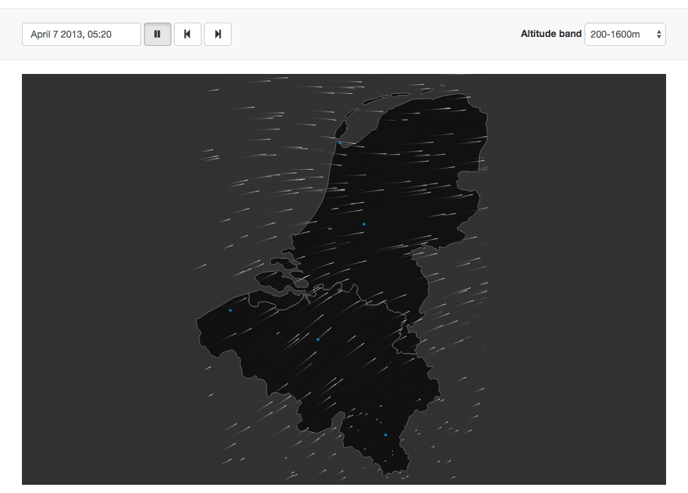

# Bird migration flow visualization

## Rationale

Weather radars can detect bird migration, but visualizing these data in an easy to understand manner is challenging. Inspired by [air](air.nullschool.net) - a [open source](https://github.com/cambecc/air) flow visualization of wind in Tokyo, created by [Cameron Beccario](https://twitter.com/cambecc) - we wondered if we could do the same for bird migration data.

## Result

<http://enram.github.io/bird-migration-flow-visualization/viz/>

We created this visualization during a 5 day hackathon on June 2 to 6, 2014, hosted at the [University of Amsterdam](http://ibed.uva.nl/research/research-groups/research-groups/research-groups/content/folder/computational-geo-ecology/computational-geo-ecology.html) in collaboration with [KMNI](http://www.knmi.nl/). It was created for the [European Network for the Radar Surveillance of Animal Movement (ENRAM)](http://enram.eu) and funded by [COST](http://cost.eu/) as a short term scientific mission ([mission report](documentation/stsm-report.md)).

## How it works

...

## Contributors

Developed by [LifeWatch INBO](http://lifewatch.inbo.be):

* [Peter Desmet](https://twitter.com/peterdesmet)
* [Bart Aelterman](https://twitter.com/bartaelterman)
* [Kevin Azijn](https://twitter.com/kazijn)

Data and guidance provided by:

* Judy Shamoun-Baranes (UvA)
* [Hans van Gasteren](https://twitter.com/hvangasteren) (RNLAF)
* Hidde Leijnse (KMNI)
* Willem Bouten (UvA)

## License

The MIT License ([LICENSE](LICENSE))